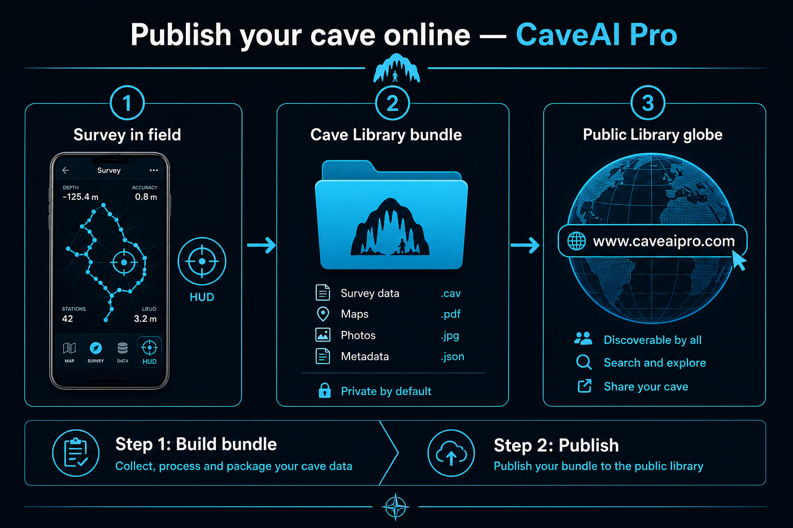
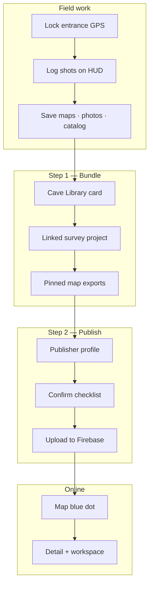
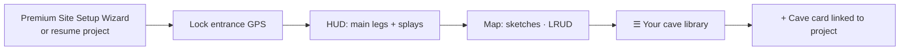
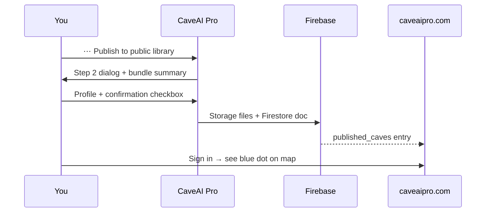
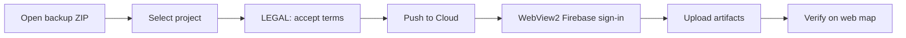

# Illustrated guide: Publish your cave online (Public Library)

Nothing uploads until **you** confirm **Publish** in Cave Library. Published caves appear on [www.caveaipro.com/map](https://www.caveaipro.com/map) for signed-in users.

---

## At a glance

| Step | Action | Where in app |
|------|--------|--------------|
| **0** | Survey the site | Active project (HUD / Map / Data) |
| **1** | Build the **bundle** | **Your cave library** + map export |
| **2** | **Publish to Public Library** | Card menu → Publish |
| **3** | Verify | Browser → `/map` (Google sign-in) |

---

## Android (recommended full survey path)

### Prerequisites

| Requirement | Notes |
|-------------|--------|
| CaveAI Pro installed | Google Play |
| Google account linked | Settings → link Google for web sync |
| Publisher profile | First name, last name, country (publish form) |
| Network | Upload uses Firebase Storage + Firestore |

### Step 0 — Survey + library card

1. Create or open a **survey project** (any site type: Cave, Mine, Pothole, Spring).
2. Lock **entrance GPS** at the mouth.
3. Record **shots** on the **HUD** tab.
4. Open **☰ menu → Your cave library**.
5. Ensure the **library card** matches the project (same name or **linked card ID**).

### Step 1 — Build the publish bundle

**Readiness chip** on each card: `Ready to publish` · `Almost` · `Needs work`.

Open the **dossier** (tap card) and check:

| Checklist row | Meaning |
|---------------|---------|
| Survey linked | A `CaveProject` matches this card |
| GPS entrance | Valid lat/lon on the card |
| Maps pinned | At least one map in the bundle |
| Cover photo | Card image for browse list |
| Link by card ID | Strong link via `linkedLibraryCaveId` |
| Catalog exported | Geo/Bio digest pushed to card (optional) |

**Pin maps (important for web X-ray):**

1. Open the linked survey → **Map** tab.
2. **Export** menu → **Cave Library bundle** (PNG / JPEG / aerial as needed).
3. Repeat for plan, section, long profile if you want them on the web workspace.

**Optional — field catalog:**

Data → Geo/Bio → **Export catalog to library** (organisms / minerals on the public card).

Filter the library list by **Ready to publish** to batch unpublished cards.

### Step 2 — Publish to Public Library

1. On the card: **⋯ More → Publish to public library** (or **Publish to Global Library**).
2. Read **Step 2 · Publish to public Cave Library** — lists JSON, photos, maps, LIDAR.
3. Review warnings (`No survey matched`, `No pinned maps`).
4. Enter **first name, last name, country**.
5. Check *"I understand this cave will be published…"*
6. Tap **CONFIRM PUBLISH** → wait for **Publishing…**

**What uploads:** cave card metadata, `survey_project.json`, gallery photos (caps apply), voice memos, cartography files, narrative text. See `docs/PUBLIC_LIBRARY_SCHEMA.md`.

### After publish — Sync updates

First publish locks **entrance coordinates** and **publisher identity**.  
To push **new maps, photos, or survey JSON**:

**⋯ More → Sync to public Cave Library → CONFIRM SYNC**

### Verify online

1. Open [www.caveaipro.com/map](https://www.caveaipro.com/map).
2. Sign in with the **same Google account**.
3. Find your **blue dot** (community published cave).
4. Open **detail → workspace** — Plan view + X-ray cartography.
5. Share: `https://www.caveaipro.com/workspace/{caveId}`

---

## Windows (CAVE AI PRO desktop)

1. Load Android backup or synced project.
2. **LEGAL & SETTINGS** — accept disclaimer.
3. Toolbar **Push to Cloud**.
4. Confirm **publish checklist** (traverse QC, photo count).
5. Sign in when WebView2 prompts (embedded Public Library auth).
6. Wait for upload completion → verify on web as above.

---

## Web-only publish (metadata)

[/publish](https://www.caveaipro.com/publish) — sign in, fill cave metadata.  
Does **not** replace a full Android survey bundle. Use for lightweight entries; full LRUD/workspace needs **Android Step 1 + 2**.

---

## Site type on the public listing

Set **Site type** in the wizard or library dossier: **Cave**, **Mine**, **Pothole**, **Spring**.  
Stored as `caveType` / `surveySiteType` and shown on maps and exports.

---

## Troubleshooting

| Symptom | Fix |
|---------|-----|
| Metadata-only publish | Link survey to card (name or library ID) |
| No X-ray on web | Re-export maps → Cave Library bundle → Sync |
| 24h publish limit | Wait; quota shared with batch publish |
| Workspace 403 | Re-publish; run storage CORS verify before deploy |
| Duplicate entrance grid | Change coords or use coord redaction setting |

---

## Safety & policy

- Publish is **explicit** and **cannot be undone** from the app.
- Coordinates and access notes are **field hints**, not safety guarantees.
- **Reference catalog** pins (OSM) are separate from **your** published surveys.

---

**See also:** Web repo `docs/CLIENT_APPS.md` · `docs/PUBLIC_LIBRARY_SCHEMA.md`
